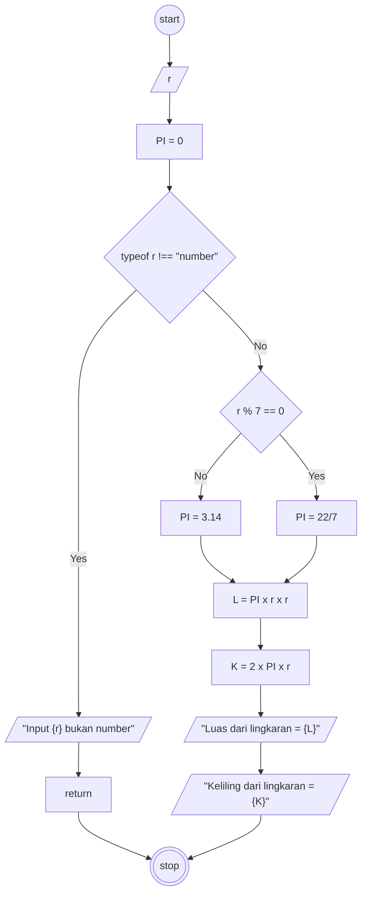

# Flowchart

## Program membuat hitung luas dan keliling lingkaran
Algoritma ini dibuat untuk merancang program hitung luas dan keliling lingkaran

```mermaid
flowchart TD
start@{shape: circle, label: "start"}
des@{shape: diam, label: " r % 7 == 0" }
piEm@{shape: rect, label: "PI = 0" }
pi@{shape:rect, label: "PI = 3.14" }
pi2@{shape:rect, label: "PI = 22/7" }
r@{shape: lean-r, label: "r"}
conType@{shape: diam, label: 'typeof r !== "number"'}
ret@{shape: rect, label: "return"}
L@{shape: rect, label: "L = PI x r x r"}
outL@{shape: lean-r, label : '"Luas dari lingkaran = {L}"'}
K@{shape: rect, label: "K = 2 x PI x r"}
logErr@{shape: lean-r, label: '"Input {r} bukan number"'}
outK@{shape: lean-r, label: '"Keliling dari lingkaran = {K}"'}
finnish@{shape: double-circle, label: "stop"}

start-->r-->piEm-->conType
conType-- Yes -->logErr-->ret-->finnish
conType-- No -->des
des-- No -->pi-->L-->K-->outL-->outK-->finnish
des-- Yes -->pi2-->L


```