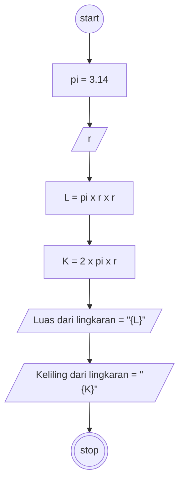

# Flowchart

## Program membuat hitung luas dan keliling lingkaran
Alagoritma ini dibuat untuk merancang program hitung luas dan keliling lingkaran

```mermaid
flowchart TD
start@{shape: circle, label: "start"}
pi@{shape:rect, label: "pi = 3.14" }
r@{shape: lean-r, label: "r"}
L@{shape: rect, label: "L = pi x r x r"}
outL@{shape: lean-r, label : 'Luas dari lingkaran = "{L}"'}
K@{shape: rect, label: "K = 2 x pi x r"}
outK@{shape: lean-r, label: 'Keliling dari lingkaran = "{K}"'}
finnish@{shape: double-circle, label: "stop"}

start-->pi-->r-->L-->K-->outL-->outK-->finnish


```