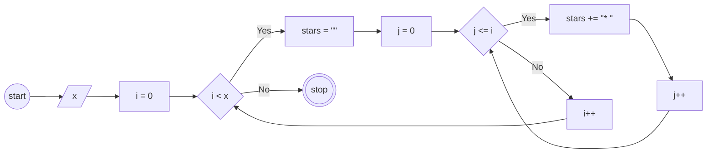

# Flowchart
## Membuat segitiga bintang dengan looping for

Algoritma ini ditulis untuk menjelaskan proses dari membuat segitiga bintang menggunakan looping for

```mermaid
flowchart LR

start@{shape: circle, label: "start"}
ref@{shape: lean-r, label: "x"}
init@{shape: rect, label: "i = 0"}
con@{shape: diam, label: "i < x"}
dec@{shape: rect, label: 'stars = ""'}
initJ@{shape: rect, label: "j = 0"}
conJ@{shape: diam, label: "j <= i"}
add@{shape: rect, label: 'stars += "* "'}
incJ@{shape: rect, label: "j++"}
inc@{shape: rect, label: "i++"}
fin@{shape: double-circle, label: "stop"}

start-->ref-->init-->con
con-- Yes -->dec-->initJ-->conJ
con-- No -->fin
conJ-- Yes -->add-->incJ
conJ-- No -->inc-->con
incJ-->conJ

```